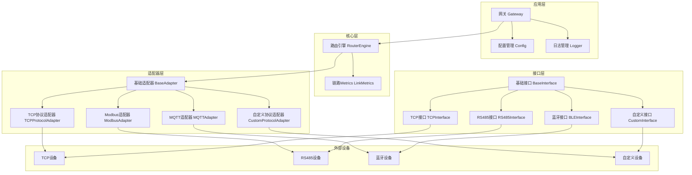

# 混合路由网关设计文档

## 1. 系统架构

混合路由网关是一个多接口、多协议的通信中间件，用于连接不同类型的设备和网络。系统采用分层架构，主要包含以下层次：

### 1.1 核心层

### 1.1.1 系统架构图

**架构说明**：

- **应用层**：包含网关、配置管理和日志管理模块
- **核心层**：包含路由引擎和链路metrics，负责路由选择和网络质量监控
- **接口层**：包含基础接口和各类具体接口实现
- **适配器层**：包含基础适配器和各类协议适配器，负责协议转换
- **外部设备**：表示通过不同接口连接的实际设备

这个架构图展示了系统的分层结构，以及各层之间的关系和交互方式。

- **路由引擎**：负责路由选择、管理和策略执行
- **链路 metrics**：监控和评估网络质量

### 1.2 接口层

- **基础接口**：定义接口的基本方法和属性
- **具体接口**：实现不同类型的通信接口
  - TCP/IP接口
  - RS485接口
  - 蓝牙接口
  - 自定义接口

### 1.3 适配器层

- **基础适配器**：定义适配器的基本方法
- **具体适配器**：实现不同协议的转换
  - TCP协议适配器
  - Modbus协议适配器
  - MQTT协议适配器
  - 自定义协议适配器

### 1.4 应用层

- **网关**：整合所有组件，提供统一的API
- **配置管理**：处理系统配置
- **日志管理**：记录系统运行状态

## 2. 核心组件

### 2.1 路由引擎 (RouterEngine)

路由引擎是系统的核心组件，负责路由选择和管理。主要功能包括：

- **接口注册**：管理所有通信接口
- **路由规则**：定义和管理路由规则
- **路由选择**：根据规则和网络质量选择最优路由
- **路由试探**：测试不同路由的可用性和性能
- **路由策略**：支持多种路由策略
- **故障转移**：当主路由失败时，自动切换到备用路由

### 2.2 接口 (Interface)

接口负责与外部设备的通信，定义了以下方法：

- **connect()**：连接到设备
- **disconnect()**：断开连接
- **send(data, timeout)**：发送数据
- **receive(timeout)**：接收数据
- **get\_status()**：获取接口状态

### 2.3 适配器 (Adapter)

适配器负责协议转换，定义了以下方法：

- **send\_message(message)**：发送消息
- **receive\_message(timeout)**：接收消息
- **serialize(message)**：序列化消息
- **deserialize(data)**：反序列化消息

### 2.4 链路 metrics (LinkMetrics)

链路 metrics 负责监控和评估网络质量，包括：

- **延迟**：消息传输的延迟时间
- **丢包率**：消息丢失的比例
- **质量评估**：根据延迟和丢包率评估网络质量

## 3. 通信接口

### 3.1 TCP/IP接口

TCP/IP接口用于与网络设备通信，支持以下功能：

- 连接到指定的IP地址和端口
- 发送和接收TCP数据
- 支持超时设置
- 支持多子网管理

### 3.2 RS485接口

RS485接口用于与串口设备通信，支持以下功能：

- 配置串口参数（波特率、奇偶校验等）
- 发送和接收串口数据
- 支持Modbus协议

### 3.3 蓝牙接口

蓝牙接口用于与蓝牙设备通信，支持以下功能：

- 连接到指定的蓝牙设备
- 发送和接收蓝牙数据
- 支持GATT协议

### 3.4 自定义接口

自定义接口用于支持用户定义的通信协议，支持以下功能：

- 自定义连接逻辑
- 自定义发送和接收逻辑
- 自定义协议处理

## 4. 协议适配器

### 4.1 TCP协议适配器

TCP协议适配器用于处理TCP协议的消息，支持以下功能：

- 序列化和反序列化TCP消息
- 处理TCP连接和数据传输

### 4.2 Modbus协议适配器

Modbus协议适配器用于处理Modbus协议的消息，支持以下功能：

- 构建Modbus请求
- 解析Modbus响应
- 计算CRC校验

### 4.3 MQTT协议适配器

MQTT协议适配器用于处理MQTT协议的消息，支持以下功能：

- 构建MQTT消息
- 解析MQTT消息
- 支持主题和负载

### 4.4 自定义协议适配器

自定义协议适配器用于处理用户定义的协议，支持以下功能：

- 自定义序列化和反序列化逻辑
- 自定义协议处理

## 5. 路由策略

### 5.1 默认策略

默认策略根据路由规则的优先级和接口状态选择路由，优先选择状态正常、优先级高的接口。

### 5.2 基于质量的策略

基于质量的策略根据网络质量选择路由，优先选择延迟低、丢包率低的接口。

### 5.3 负载均衡策略

负载均衡策略在多个可用接口之间随机选择，实现负载均衡。

### 5.4 自定义策略

用户可以定义自己的路由策略，根据特定的需求选择路由。

## 6. 双向通信

系统支持双向通信，实现设备间的实时数据传输：

- **发送**：通过适配器发送消息到设备
- **接收**：通过适配器接收设备的消息
- **处理**：处理接收到的消息，根据需要进行路由或响应

## 7. 多子网管理

系统支持多子网管理，实现不同子网之间的通信：

- **子网匹配**：使用CIDR格式表示子网，支持精确的子网匹配
- **跨子网路由**：根据路由规则和子网信息选择跨子网的路由

## 8. 路由试探

系统支持路由试探，测试不同路由的可用性和性能：

- **单路由试探**：测试单个路由的可用性和延迟
- **多路由试探**：测试所有可用路由的可用性和性能
- **结果分析**：根据试探结果评估路由质量

## 9. 配置管理

系统通过配置文件管理接口和路由规则：

- **接口配置**：配置接口的类型、参数和状态
- **路由规则**：配置路由的规则、优先级和接口
- **适配器配置**：配置适配器的参数和状态

## 10. 日志管理

系统通过日志记录运行状态和错误信息：

- **日志级别**：支持DEBUG、INFO、WARN、ERROR四个级别
- **日志输出**：支持控制台和文件输出
- **日志格式**：包含时间戳、级别和消息内容

## 11. 扩展性

系统设计具有良好的扩展性：

- **接口扩展**：可以添加新的通信接口类型
- **适配器扩展**：可以添加新的协议适配器
- **策略扩展**：可以添加新的路由策略
- **功能扩展**：可以添加新的功能模块

## 12. 安全性

系统考虑了安全性：

- **接口认证**：支持接口的认证和授权
- **数据加密**：支持数据的加密传输
- **访问控制**：支持访问控制和权限管理

## 13. 性能优化

系统进行了性能优化：

- **消息队列**：使用消息队列处理消息，提高并发性能
- **线程管理**：使用协程管理接收线程，提高系统响应速度
- **缓存机制**：缓存路由选择结果，减少重复计算

## 14. 测试和验证

系统提供了测试和验证机制：

- **单元测试**：测试各个组件的功能
- **集成测试**：测试系统的整体功能
- **性能测试**：测试系统的性能和可靠性

## 15. 部署和维护

系统的部署和维护：

- **部署方式**：支持本地部署和远程部署
- **配置管理**：支持配置的动态更新
- **监控和告警**：支持系统状态的监控和告警

## 16. 总结

混合路由网关是一个功能强大、灵活可扩展的通信中间件，支持多种通信接口和协议，实现了智能路由和双向通信。系统的设计考虑了扩展性、安全性和性能，能够满足不同场景的需求。
