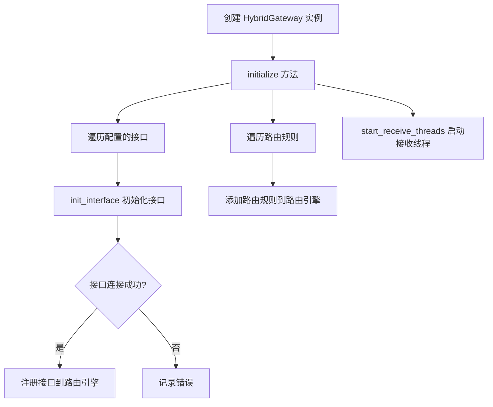
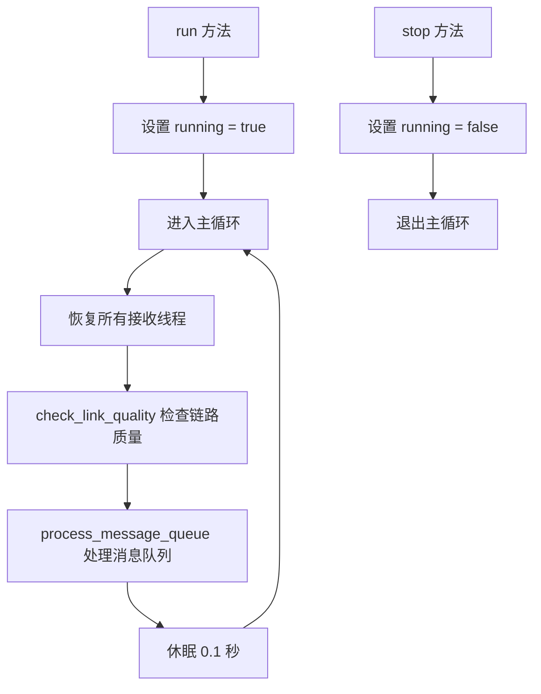
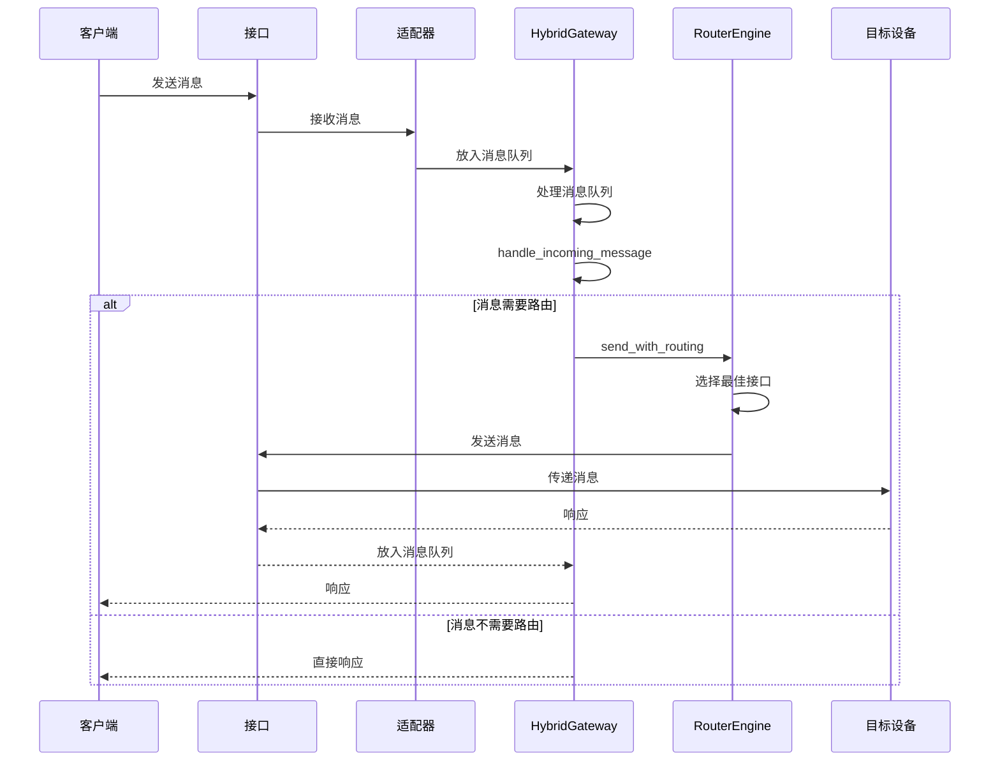

# Gateway 模块详解

## 目录

- [概述](#概述)
- [模块结构](#模块结构)
- [核心组件](#核心组件)
- [主要流程](#主要流程)
- [消息处理机制](#消息处理机制)
- [接口管理](#接口管理)
- [路由规则](#路由规则)
- [状态监控](#状态监控)
- [代码示例](#代码示例)

---

## 概述

`gateway.lua` 是整个路由网关的核心模块，负责：

- 初始化和管理各种接口（TCP、PLC等）
- 注册和应用路由规则
- 处理消息的接收和发送
- 监控链路质量
- 提供主运行循环

## 模块结构

### 核心类

| 类名 | 职责 |
|------|------|
| `HybridGateway` | 网关主类，管理整个路由系统 |
| `RouterEngine` | 路由引擎，处理路由逻辑 |
| `InterfaceFactory` | 接口工厂，创建不同类型的接口 |
| `AdapterFactory` | 适配器工厂，创建不同协议的适配器 |

### 主要依赖

| 模块 | 用途 |
|------|------|
| `config` | 配置文件 |
| `core.router_engine` | 路由引擎 |
| `platform` | 平台相关功能 |
| `utils.error` | 错误处理 |
| `utils.logger` | 日志记录 |
| `cjson` (可选) | JSON 序列化/反序列化 |

## 核心组件

### 1. 接口工厂 (InterfaceFactory)

创建不同类型的接口实例。

| 接口类型 | 模块路径 | 状态 |
|----------|----------|------|
| `tcp` | `interfaces.tcp_interface` | 启用 |
| `plc` | `interfaces.plc_interface` | 启用 |
| `rs485` | `interfaces.rs485_interface` | 注释 |
| `ble` | `interfaces.ble_interface` | 注释 |
| `can` | `interfaces.can_interface` | 注释 |
| `custom` | `interfaces.custom_interface` | 注释 |

### 2. 适配器工厂 (AdapterFactory)

创建不同协议的适配器实例。

| 适配器类型 | 模块路径 | 状态 |
|------------|----------|------|
| `tcp` | `adapters.tcp_protocol_adapter` | 启用 |
| `plc` | `adapters.plc_protocol_adapter` | 启用 |
| `rs485` | `adapters.modbus_adapter` | 注释 |
| `ble` | `adapters.mqtt_adapter` | 注释 |
| `can` | `adapters.mqtt_adapter` | 注释 |
| `custom` | `adapters.custom_protocol_adapter` | 注释 |

### 3. HybridGateway 类

#### 主要属性

| 属性 | 类型 | 说明 |
|------|------|------|
| `config` | table | 配置对象 |
| `router_engine` | RouterEngine | 路由引擎实例 |
| `running` | boolean | 运行状态 |
| `message_queue` | array | 消息队列 |
| `receive_threads` | table | 接收线程表 |

#### 主要方法

| 方法 | 功能 |
|------|------|
| `new()` | 创建新的网关实例 |
| `initialize()` | 初始化网关 |
| `init_interface()` | 初始化单个接口 |
| `start_receive_threads()` | 启动接收线程 |
| `handle_message()` | 处理消息路由 |
| `run()` | 主运行循环 |
| `check_link_quality()` | 检查链路质量 |
| `process_message_queue()` | 处理消息队列 |
| `handle_incoming_message()` | 处理入站消息 |
| `stop()` | 停止网关 |

## 主要流程

### 1. 初始化流程



### 2. 运行流程



## 消息处理机制

### 1. 消息接收

- 每个接口对应一个协程（coroutine）接收线程
- 线程通过适配器的 `receive_message` 方法接收消息
- 收到的消息放入 `message_queue` 队列

### 2. 消息处理

- `process_message_queue` 方法处理队列中的消息
- 调用 `handle_incoming_message` 处理入站消息
- 对于请求类型的消息，返回 ACK 响应

### 3. 消息路由

- `handle_message` 方法调用路由引擎的 `send_with_routing` 方法
- 根据设备 ID、源子网和目标子网选择最佳路由
- 记录路由结果

### 4. 消息处理时序图



### 6. 网络发现功能

**功能说明**：通过指定接口自动发现网络中的设备并注册到路由引擎，支持多种接口类型（TCP、RS485、BLE、PLC等）。

**工作原理**：
1. 客户端发送包含 `discover_network: true` 的 discover 消息
2. 可选指定 `interface` 字段来指定发现接口
3. 网关调用指定接口的 `scan_devices()` 方法进行设备扫描
4. 发现的设备自动注册到路由引擎
5. 基于发现的设备构建网络拓扑
6. 返回包含所有已注册设备的响应

**支持的接口类型**：
- TCP 接口
- RS485 接口
- BLE 接口
- PLC 接口
- 其他实现了 `scan_devices()` 方法的自定义接口

**使用示例**：
```lua
-- 基本发现请求
local discover_msg = {
    type = "discover",
    device_id = "client_001"
}

-- 网络发现请求（指定接口）
local network_discover_msg = {
    type = "discover",
    device_id = "client_001",
    discover_network = true,
    interface = "plc_main"
}
```

### 5. 消息报文格式

#### 5.1 注册消息 (register)

**请求格式**：
```lua
{
    type = "register",
    device_id = "device_001",
    device_info = {
        id = "device_001",
        name = "Temperature Sensor",
        type = "sensor",
        interfaces = {"tcp", "rs485"},
        metadata = {}
    }
}
```

**回复格式**：
```lua
-- 成功
{
    type = "register_response",
    status = "success",
    device_id = "device_001"
}

-- 失败
{
    type = "register_response",
    status = "error",
    message = "Failed to register device"
}
```

#### 5.2 心跳消息 (heartbeat)

**请求格式**：
```lua
{
    type = "heartbeat",
    device_id = "device_001",
    timestamp = 1620000000
}
```

**回复格式**：
```lua
{
    type = "heartbeat_response",
    timestamp = 1620000000
}
```

#### 5.3 转发消息 (forward)

**请求格式**：
```lua
{
    type = "forward",
    device_id = "device_001",
    source_device = "device_001",
    target_device = "device_002",
    message = {
        type = "command",
        data = "turn_on",
        parameters = {}
    }
}
```

**回复格式**：
```lua
-- 成功
{
    type = "forward_response",
    status = "success",
    path = ["tcp_subnet1", "tcp_subnet2"]
}

-- 失败
{
    type = "forward_response",
    status = "error",
    message = "Failed to forward message"
}
```

#### 5.4 发现消息 (discover)

**请求格式**：
```lua
{
    type = "discover",
    device_id = "device_001"
}
```

**网络发现请求格式**：
```lua
{
    type = "discover",
    device_id = "device_001",
    discover_network = true,  -- 启用网络发现
    interface = "tcp_subnet1"  -- 可选，指定发现接口
}
```

**回复格式**：
```lua
{
    type = "discover_response",
    devices = [
        {
            id = "device_001",
            name = "Temperature Sensor",
            type = "sensor",
            interfaces = ["tcp"]
        },
        {
            id = "device_002",
            name = "Light Controller",
            type = "actuator",
            interfaces = ["rs485"]
        }
    ]
}
```

#### 5.5 请求消息 (request)

**请求格式**：
```lua
{
    type = "request",
    device_id = "device_001",
    data = "Hello, Gateway!"
}
```

**回复格式**：
```lua
{
    type = "response",
    device_id = "device_001",
    timestamp = 1620000000,
    data = "ACK"
}
```

## 接口管理

### 接口初始化流程

1. 遍历配置文件中的 `interfaces` 数组
2. 对每个启用的接口：
   - 从 `InterfaceFactory` 获取对应类型的接口类
   - 从 `AdapterFactory` 获取对应类型的适配器类
   - 创建接口实例
   - 创建适配器实例
   - 尝试连接接口
   - 连接成功后注册到路由引擎

### 接口状态监控

- 每 10 次主循环检查一次接口状态
- 输出接口的连接状态、延迟、丢包率和质量等级

## 路由规则

- 从配置文件的 `routing_rules` 数组加载路由规则
- 规则按 `priority` 字段从高到低排序
- 每个规则包含：设备 ID、源子网、目标子网、接口列表等信息
- 路由引擎根据规则选择最佳接口

## 状态监控

### 链路质量检查

- 每 10 次主循环执行一次
- 调用路由引擎的 `get_routing_status` 方法获取状态
- 输出每个接口的：
  - 连接状态
  - 延迟（毫秒）
  - 丢包率（百分比）
  - 质量等级

### 日志记录

- 使用 `utils.logger` 记录不同级别的日志
- 初始化、连接、路由等关键操作都有日志记录
- 错误和异常情况有详细的错误信息

## 代码示例

### 基本用法

```lua
local HybridGateway = require("gateway")

local gateway = HybridGateway.new()
gateway:initialize()
gateway:run()
```

### 发送消息

```lua
local message = {
    device_id = "device_001",
    data = "Hello, Router!",
    src_subnet = "192.168.1.0/24",
    dst_subnet = "192.168.2.0/24"
}

gateway:handle_message(message.device_id, message)
```

### 停止网关

```lua
gateway:stop()
```

## 扩展指南

### 添加新接口类型

1. 在 `InterfaceFactory` 中添加新的接口类型
2. 在 `AdapterFactory` 中添加对应的适配器
3. 在配置文件中添加接口配置

### 自定义路由策略

1. 实现自定义路由策略函数
2. 在配置文件的 `routing.default_strategy` 中设置为自定义策略名称
3. 在路由引擎中注册该策略

### 消息处理扩展

可以重写 `handle_incoming_message` 方法来处理特定类型的消息：

```lua
function HybridGateway:handle_incoming_message(device_id, message, interface_name)
    if message.type == "sensor_data" then
        -- 处理传感器数据
        return {
            type = "ack",
            device_id = device_id,
            data = "Data received"
        }
    elseif message.type == "command" then
        -- 处理命令
        return {
            type = "response",
            device_id = device_id,
            data = "Command executed"
        }
    end
    return nil
end
```

## 性能优化

1. **消息队列处理**：使用 `table.remove` 从队列头部取出消息，对于大量消息可能效率较低，可以考虑使用双向链表。

2. **协程管理**：每个接口一个协程，对于大量接口可能会有性能问题，可以考虑使用线程池。

3. **状态检查频率**：每 10 次主循环检查一次状态，可以根据实际需求调整频率。

4. **错误处理**：当前的错误处理较为简单，可以添加更详细的错误恢复机制。

## 故障排查

### 常见问题

| 问题 | 可能原因 | 解决方案 |
|------|----------|----------|
| 接口连接失败 | 网络问题、配置错误 | 检查网络连接和接口配置 |
| 路由失败 | 无可用接口、路由规则不匹配 | 检查接口状态和路由规则配置 |
| 消息丢失 | 消息队列溢出、处理速度过慢 | 增加队列容量或优化处理逻辑 |
| 性能下降 | 协程数量过多、消息处理复杂 | 优化协程管理和消息处理逻辑 |

### 日志分析

- **INFO 级别**：记录初始化、连接、状态等基本信息
- **DEBUG 级别**：记录详细的消息处理和路由过程
- **ERROR 级别**：记录错误和异常情况
- **WARN 级别**：记录警告信息，如接口连接不稳定等

通过分析日志可以快速定位和解决问题。