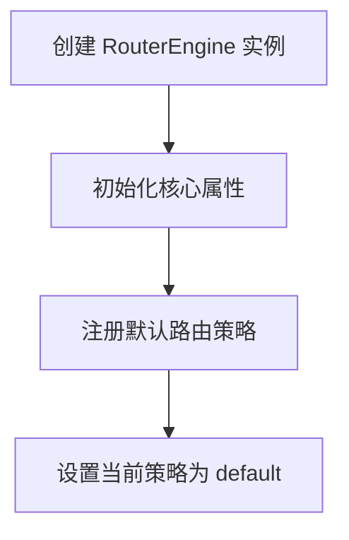
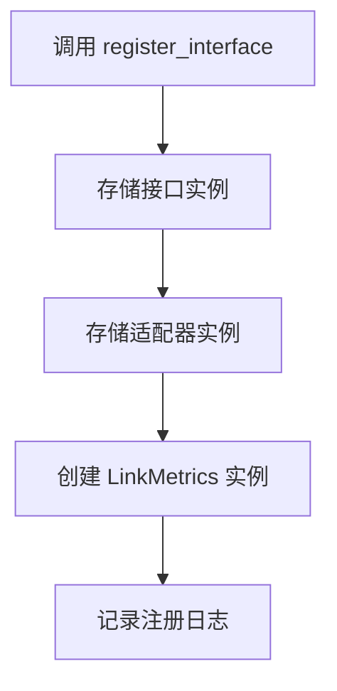
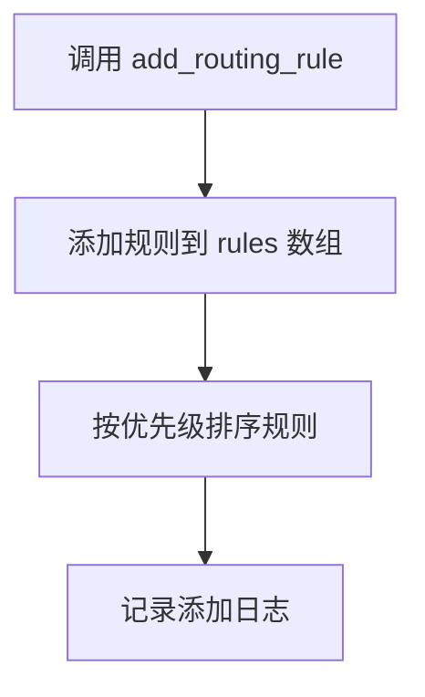
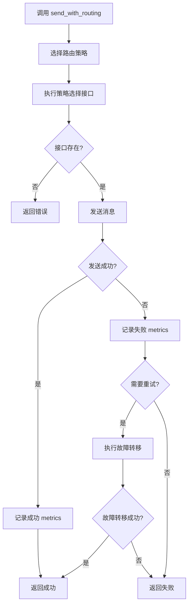
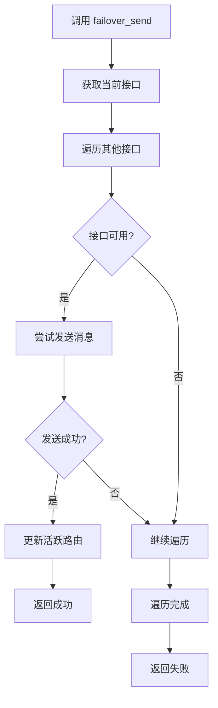
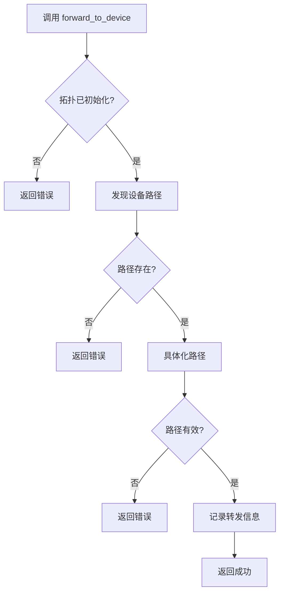
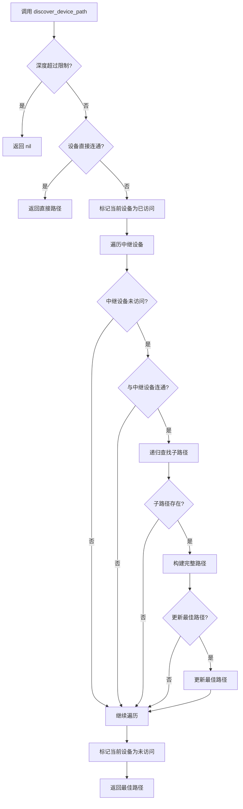

# Router Engine 设计文档

## 目录

- [概述](#概述)
- [核心功能](#核心功能)
- [数据结构](#数据结构)
- [路由策略](#路由策略)
- [主要流程](#主要流程)
- [多设备支持](#多设备支持)
- [故障处理](#故障处理)
- [状态管理](#状态管理)
- [接口设计](#接口设计)
- [扩展机制](#扩展机制)

---

## 概述

`RouterEngine` 是路由网关的核心组件，负责管理接口、应用路由规则、选择最佳路由路径以及处理消息转发。它提供了灵活的路由策略机制，支持多种路由算法，并具备多设备网络拓扑管理能力。

**主要职责**：
- 接口注册和管理
- 路由规则管理
- 链路质量监控
- 路由策略选择
- 消息转发和故障转移
- 多设备网络拓扑管理

## 核心功能

### 1. 接口管理

- **接口注册**：注册网络接口及其对应的适配器
- **链路质量监控**：通过 `LinkMetrics` 跟踪接口的性能指标
- **路由探测**：定期探测接口状态和性能

### 2. 路由规则管理

- **规则添加**：添加和排序路由规则（按优先级）
- **规则匹配**：根据设备 ID、源子网和目标子网匹配规则
- **接口选择**：从匹配的规则中选择最佳接口

### 3. 路由策略

- **默认策略**：基于规则优先级和接口质量选择接口
- **质量优先策略**：选择质量最高的接口
- **负载均衡策略**：随机选择可用接口
- **自定义策略**：支持用户定义的路由策略

### 4. 多设备支持

- **设备拓扑管理**：注册和管理多设备网络拓扑
- **路径发现**：使用 BFS 算法发现设备间的路由路径
- **路径具体化**：为路径选择具体的接口和协议
- **消息转发**：在设备间转发消息

### 5. 故障处理

- **故障转移**：当主接口失败时自动切换到备用接口
- **错误处理**：记录和处理各种错误情况

## 数据结构

### 1. 核心属性

| 属性 | 类型 | 说明 |
|------|------|------|
| `rules` | table | 路由规则数组，按优先级排序 |
| `interfaces` | table | 接口实例表，键为接口名称 |
| `adapters` | table | 适配器实例表，键为接口名称 |
| `metrics` | table | 链路质量指标表，键为接口名称 |
| `active_routes` | table | 活跃路由表，键为设备 ID |
| `probe_threads` | table | 路由探测线程表 |
| `routing_strategies` | table | 路由策略表，键为策略名称 |
| `current_strategy` | string | 当前使用的路由策略名称 |
| `topology` | table | 网络拓扑配置 |
| `devices` | table | 设备信息表，键为设备 ID |
| `device_interfaces` | table | 设备接口表，键为设备 ID |

### 2. 路由规则结构

```lua
{
    name = "rule_name",
    priority = 100,  -- 优先级，数字越大优先级越高
    enabled = true,  -- 是否启用
    device_id = "device_001",  -- 设备 ID
    source_subnet = "192.168.1.0/24",  -- 源子网
    target_subnet = "192.168.2.0/24",  -- 目标子网
    interfaces = {"tcp_subnet1", "tcp_subnet2"}  -- 可用接口列表
}
```

### 3. 设备信息结构

```lua
{
    device_id = "device_001",
    is_relay = true,  -- 是否为中继设备
    interfaces = {
        {
            type = "tcp",
            port = "8080",
            priority = 50
        },
        {
            type = "rs485",
            port = "COM1",
            priority = 30
        }
    }
}
```

## 路由策略

### 1. 默认策略 (default)

- **逻辑**：按照规则优先级，选择第一个状态为 "connected" 且质量等级 >= FAIR 的接口
- **适用场景**：一般网络环境，注重规则优先级

### 2. 质量优先策略 (quality_based)

- **逻辑**：选择匹配规则中质量最高的接口
- **适用场景**：对网络质量要求较高的场景

### 3. 负载均衡策略 (load_balanced)

- **逻辑**：随机选择匹配规则中的可用接口
- **适用场景**：需要负载均衡的场景

### 4. 自定义策略

- **逻辑**：用户自定义的路由选择逻辑
- **适用场景**：特殊网络环境或特定业务需求

## 主要流程

### 1. 初始化流程



### 2. 接口注册流程



### 3. 路由规则添加流程



### 4. 消息发送流程



### 5. 故障转移流程



### 6. 多设备消息转发流程



### 7. 设备路径发现流程



## 多设备支持

### 1. 设备拓扑管理

- **拓扑注册**：通过 `register_device_topology` 注册网络拓扑
- **设备注册**：通过 `register_device` 动态添加设备
- **设备注销**：通过 `unregister_device` 移除设备

### 2. 路径发现算法

- **BFS 算法**：使用广度优先搜索发现最短路径
- **最大深度限制**：防止无限递归（最大深度为 10）
- **中继设备**：只通过标记为 `is_relay` 的设备进行转发

### 3. 路径具体化

- **协议匹配**：为路径中的每一跳选择匹配的协议
- **地址构建**：构建源地址和目标地址
- **路径验证**：确保路径的有效性

## 故障处理

### 1. 错误类型

| 错误码 | 描述 | 处理方式 |
|--------|------|----------|
| INTERFACE_NOT_FOUND | 接口未找到 | 记录错误并返回失败 |
| INTERFACE_NOT_CONNECTED | 接口未连接 | 记录错误并返回失败 |
| INTERFACE_SEND_FAILED | 接口发送失败 | 记录失败 metrics 并尝试故障转移 |
| NO_AVAILABLE_ROUTE | 无可用路由 | 记录错误并返回失败 |
| ROUTE_NOT_FOUND | 路由未找到 | 记录错误并返回失败 |
| NO_PATH_FOUND | 无路径找到 | 记录错误并返回失败 |
| INVALID_PARAM | 参数无效 | 记录错误并返回失败 |
| INVALID_ROUTING_STRATEGY | 无效的路由策略 | 记录错误并返回失败 |
| CUSTOM_STRATEGY_NOT_FUNCTION | 自定义策略不是函数 | 记录错误并返回失败 |

### 2. 故障转移机制

- **触发条件**：当主接口发送失败时
- **处理逻辑**：尝试使用其他可用接口发送消息
- **成功处理**：更新活跃路由并返回成功
- **失败处理**：返回失败并记录错误

## 状态管理

### 1. 接口状态

- **连接状态**：通过接口的 `get_status()` 方法获取
- **链路质量**：通过 `LinkMetrics` 计算质量等级
- **性能指标**：延迟、丢包率、错误率

### 2. 路由状态

- **活跃路由**：记录每个设备的当前活跃接口
- **路由规则**：记录所有路由规则及其状态
- **拓扑状态**：记录设备拓扑和连接关系

### 3. 状态查询

- **get_routing_status()**：获取完整的路由状态信息
- **get_registered_devices()**：获取已注册的设备列表

## 接口设计

### 1. 核心接口

| 方法 | 参数 | 返回值 | 功能 |
|------|------|--------|------|
| `new()` | 无 | RouterEngine 实例 | 创建路由引擎实例 |
| `register_interface(name, interface, adapter)` | name: 接口名称<br>interface: 接口实例<br>adapter: 适配器实例 | 无 | 注册接口 |
| `add_routing_rule(rule)` | rule: 路由规则 | 无 | 添加路由规则 |
| `send_with_routing(message, device_id, src_subnet, dst_subnet, retry_on_fail)` | message: 消息<br>device_id: 设备 ID<br>src_subnet: 源子网<br>dst_subnet: 目标子网<br>retry_on_fail: 是否重试 | boolean | 带路由的消息发送 |
| `get_routing_status()` | 无 | table | 获取路由状态 |
| `set_routing_strategy(strategy_name)` | strategy_name: 策略名称 | boolean | 设置路由策略 |
| `add_custom_strategy(name, strategy_func)` | name: 策略名称<br>strategy_func: 策略函数 | boolean | 添加自定义策略 |

### 2. 多设备接口

| 方法 | 参数 | 返回值 | 功能 |
|------|------|--------|------|
| `register_device_topology(topology_config)` | topology_config: 拓扑配置 | 无 | 注册设备拓扑 |
| `register_device(device_id, interfaces)` | device_id: 设备 ID<br>interfaces: 接口列表 | boolean | 注册设备 |
| `unregister_device(device_id)` | device_id: 设备 ID | boolean | 注销设备 |
| `forward_to_device(message, src_device, dst_device)` | message: 消息<br>src_device: 源设备<br>dst_device: 目标设备 | boolean, table | 转发消息到设备 |
| `get_registered_devices()` | 无 | table | 获取已注册设备列表 |

### 3. 辅助接口

| 方法 | 参数 | 返回值 | 功能 |
|------|------|--------|------|
| `probe_route(interface_name, test_message)` | interface_name: 接口名称<br>test_message: 测试消息 | boolean, number | 探测路由 |
| `probe_all_routes(test_message)` | test_message: 测试消息 | table | 探测所有路由 |
| `select_best_interface(device_id, src_subnet, dst_subnet)` | device_id: 设备 ID<br>src_subnet: 源子网<br>dst_subnet: 目标子网 | string | 选择最佳接口 |
| `subnet_match(ip, subnet)` | ip: IP 地址<br>subnet: 子网 | boolean | 子网匹配 |
| `parse_device_address(addr_str)` | addr_str: 地址字符串 | table | 解析设备地址 |
| `is_directly_connected(device_a, device_b)` | device_a: 设备 A<br>device_b: 设备 B | boolean | 检查设备是否直接连通 |
| `discover_device_path(src_device, dst_device, visited, depth)` | src_device: 源设备<br>dst_device: 目标设备<br>visited: 已访问设备<br>depth: 当前深度 | table | 发现设备路径 |
| `materialize_path(path)` | path: 路径 | table | 具体化路径 |

## 扩展机制

### 1. 路由策略扩展

- **添加自定义策略**：通过 `add_custom_strategy` 添加自定义路由策略
- **策略函数签名**：`function(self, device_id, src_subnet, dst_subnet) return interface_name end`
- **策略选择**：通过 `set_routing_strategy` 切换路由策略

### 2. 设备拓扑扩展

- **动态设备管理**：通过 `register_device` 和 `unregister_device` 动态管理设备
- **拓扑配置**：支持通过 `register_device_topology` 加载完整的网络拓扑

### 3. 接口扩展

- **接口类型**：支持添加新的接口类型
- **适配器扩展**：支持为新接口类型创建对应的适配器

## 性能优化

### 1. 路由缓存

- **活跃路由表**：缓存每个设备的当前活跃接口，减少重复计算
- **路径缓存**：可以考虑添加路径缓存，减少路径发现的开销

### 2. 并发处理

- **探测线程**：使用协程进行路由探测，不阻塞主流程
- **消息处理**：可以考虑使用消息队列进行异步处理

### 3. 算法优化

- **路径发现**：对于大型网络，可以考虑使用更高效的路径发现算法
- **规则匹配**：对于大量规则，可以优化规则匹配逻辑

## 安全性考虑

### 1. 输入验证

- **参数验证**：对所有输入参数进行验证，防止无效输入
- **地址解析**：安全解析设备地址，防止注入攻击

### 2. 错误处理

- **错误记录**：详细记录错误信息，便于故障排查
- **异常处理**：合理处理异常情况，防止系统崩溃

### 3. 访问控制

- **设备注册**：可以考虑添加设备注册的验证机制
- **消息转发**：可以添加消息转发的权限控制

## 总结

`RouterEngine` 是一个功能强大、设计灵活的路由引擎，提供了完整的路由管理功能。它支持多种路由策略，具备多设备网络拓扑管理能力，并提供了丰富的扩展机制。通过合理的设计和实现，它能够满足各种复杂网络环境的路由需求。

**核心优势**：
- 灵活的路由策略机制
- 完善的链路质量监控
- 强大的多设备支持
- 可靠的故障转移机制
- 丰富的扩展接口

**应用场景**：
- 工业物联网网关
- 多协议设备互联
- 复杂网络环境的路由管理
- 需要智能路由决策的系统